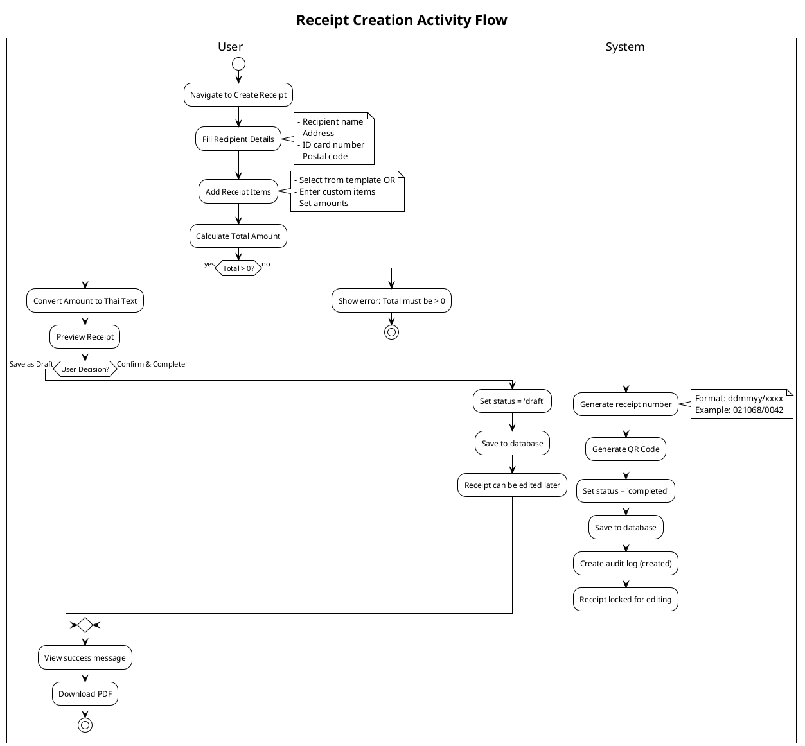
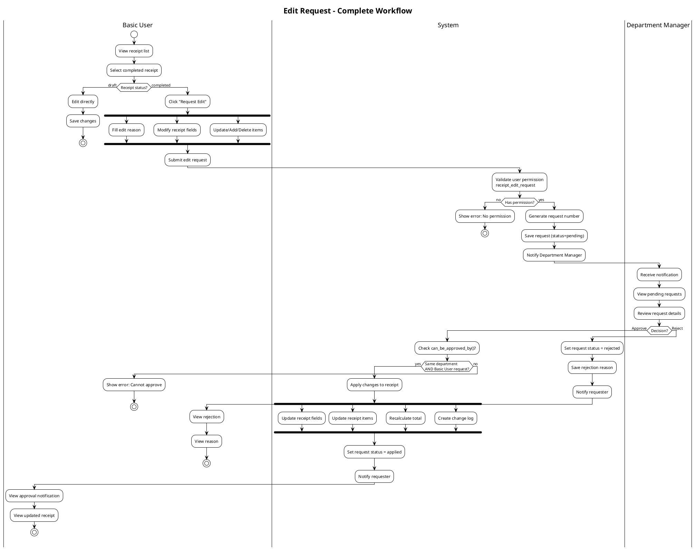
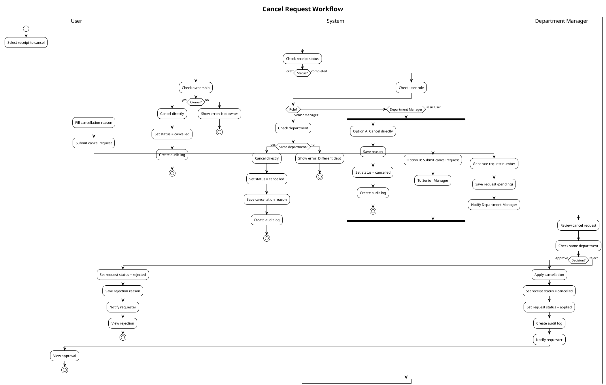
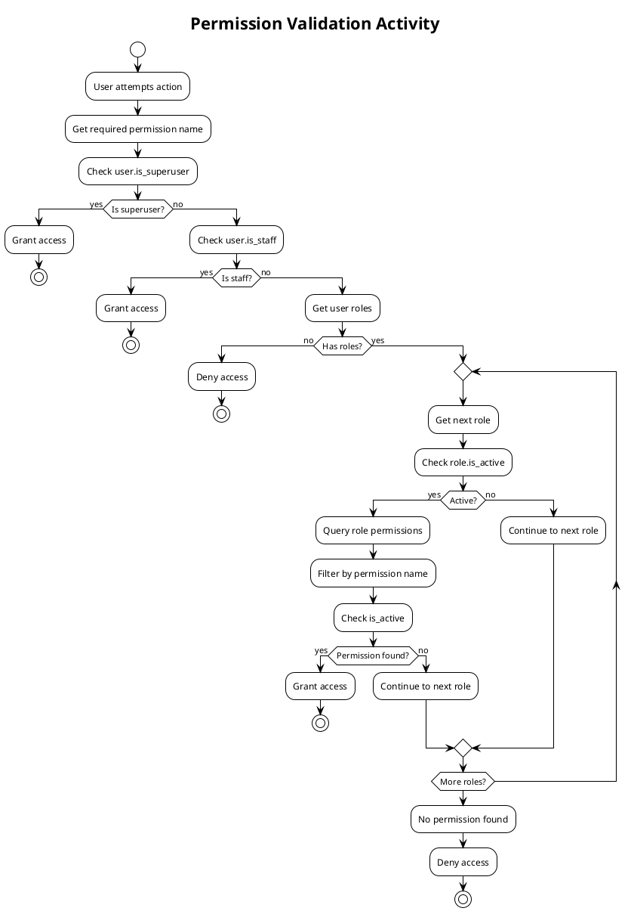
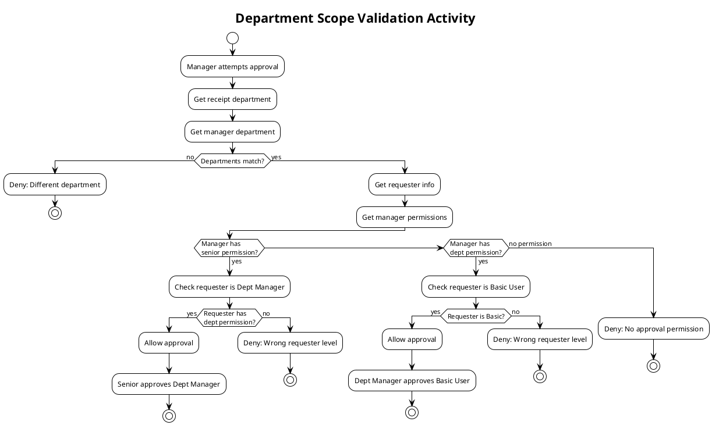
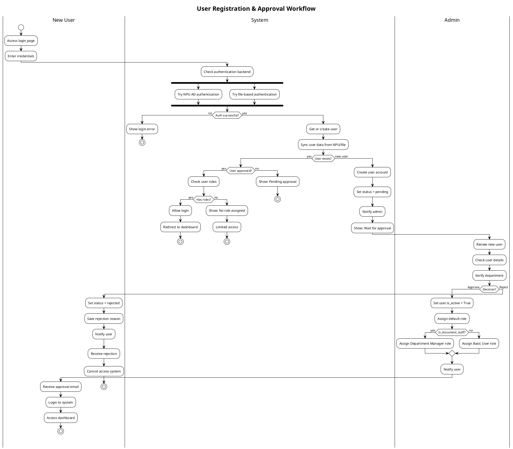
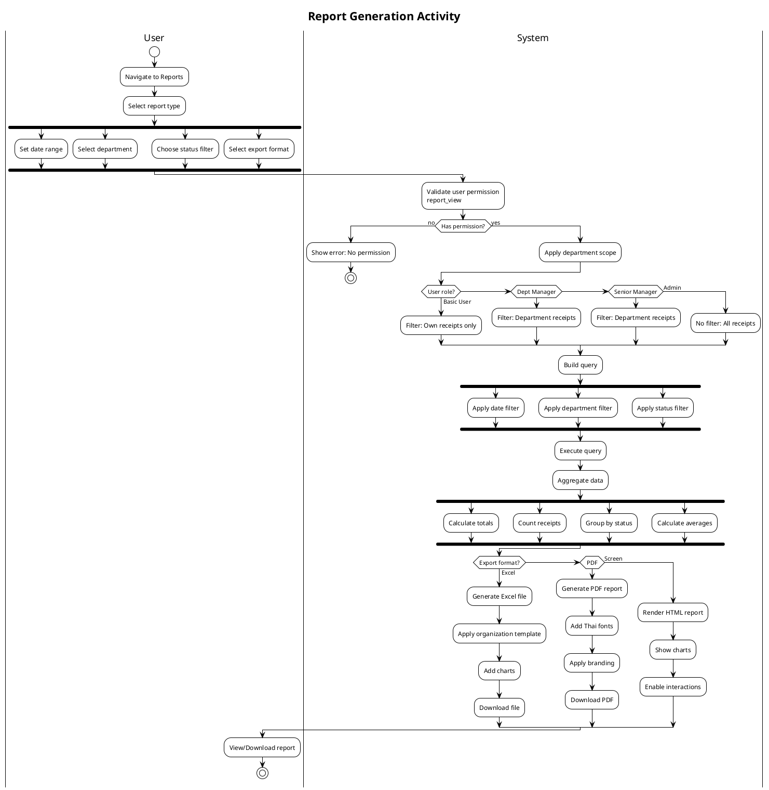
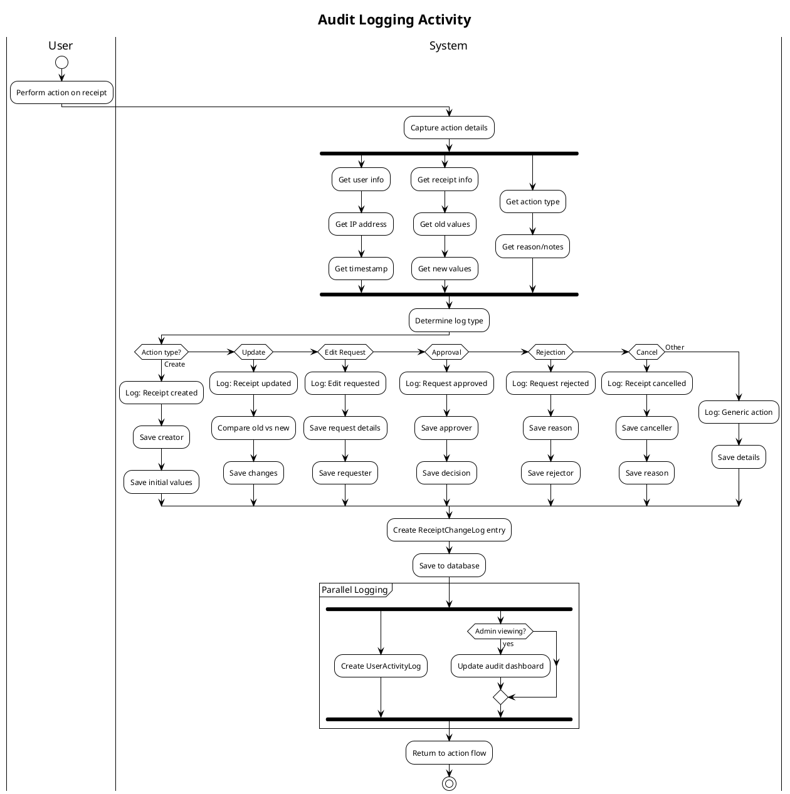

# 🔄 UML Activity Diagrams - E-Money Voucher System

## 1. Receipt Creation Activity Diagram

---

## 2. Edit Request Submission & Approval Activity

---

## 3. Cancel Request Activity Diagram

---

## 4. Permission Check Activity Diagram

---

## 5. Department Scope Validation Activity

---

## 6. User Registration & Approval Activity

---

## 7. Report Generation Activity

---

## 8. Audit Log Activity

---

## Notes:
- All activities include permission checks
- Department scope is enforced at every step
- Audit logging happens automatically
- State transitions are atomic transactions
- Error handling returns to appropriate point

