# 📐 UML Class Diagram - E-Money Voucher System

## 1. Core Models Class Diagram

---

## 2. Role & Permission Relationship

```plantuml
@startuml
!theme plain

package "Role System" {

  class "System Admin" as Admin {
    Permissions:
    ✅ receipt_view_all
    ✅ receipt_export
    ✅ user_manage
    ✅ role_manage
    ✅ system_config
    ✅ report_view
  }

  class "Senior Manager" as Senior {
    Permissions:
    ✅ receipt_create
    ✅ receipt_view_own
    ✅ receipt_view_department
    ✅ receipt_edit_request
    ✅ receipt_edit_approve
    ✅ receipt_edit_approve_manager ⭐
    ✅ receipt_cancel_request
    ✅ receipt_cancel_approve
    ✅ receipt_cancel_approve_manager ⭐
    ✅ receipt_cancel_department
    ✅ report_view
  }

  class "Department Manager" as DeptMgr {
    Permissions:
    ✅ receipt_create
    ✅ receipt_view_own
    ✅ receipt_view_department
    ✅ receipt_edit_request
    ✅ receipt_edit_approve ⭐
    ✅ receipt_cancel_request
    ✅ receipt_cancel_approve ⭐
    ✅ receipt_cancel_department
  }

  class "Basic User" as Basic {
    Permissions:
    ✅ receipt_create
    ✅ receipt_view_own
    ✅ receipt_edit_request
    ✅ receipt_edit_request_view
    ✅ receipt_edit_withdraw
    ✅ receipt_cancel_request
    ✅ receipt_cancel_request_view
    ✅ receipt_cancel_withdraw
  }
}

Admin -down-> Senior: manages
Senior -down-> DeptMgr: approves requests from
DeptMgr -down-> Basic: approves requests from

note right of Senior
  ⭐ Key Permissions:
  - Approves Dept Manager edit requests
  - Approves Dept Manager cancel requests
  - Can cancel receipts directly
end note

note right of DeptMgr
  ⭐ Key Permissions:
  - Approves Basic User edit requests
  - Approves Basic User cancel requests
  - Can cancel receipts directly
end note

@enduml
```

---

## 3. Permission Inheritance Diagram

---

## 4. Department Scope Diagram

```plantuml
@startuml
!theme plain

package "Department A" {
  actor "Senior A" as sa
  actor "Dept Mgr A" as dma
  actor "Basic A" as ba

  sa -down-> dma: approves
  dma -down-> ba: approves
}

package "Department B" {
  actor "Senior B" as sb
  actor "Dept Mgr B" as dmb
  actor "Basic B" as bb

  sb -down-> dmb: approves
  dmb -down-> bb: approves
}

actor "System Admin" as admin

admin -down-> sa: manages all
admin -down-> sb: manages all

note right of admin
  Can access ALL departments
  No scope restrictions
end note

note bottom of sa
  ❌ CANNOT approve requests from Dept B
  ✅ CAN approve requests from Dept A only

  Scope Rule:
  user.department == receipt.department.name
end note

@enduml
```

---

## Notes:
- ⭐ = Key distinguishing permissions
- All relationships follow department scope rules (except Admin)
- Approval flow is strictly hierarchical within same department
- Cross-department access is Admin-only

