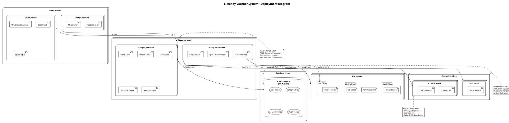
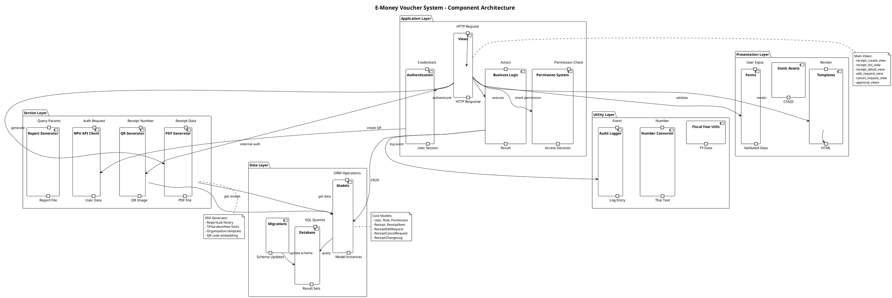
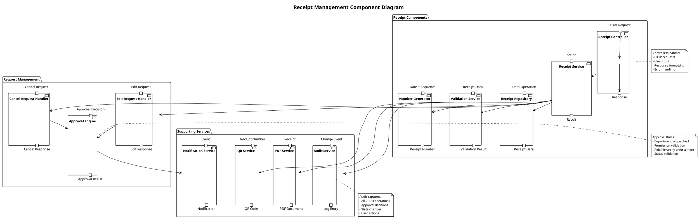
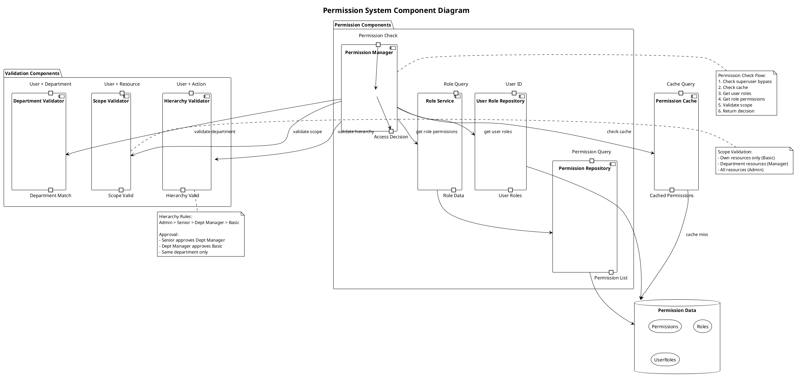
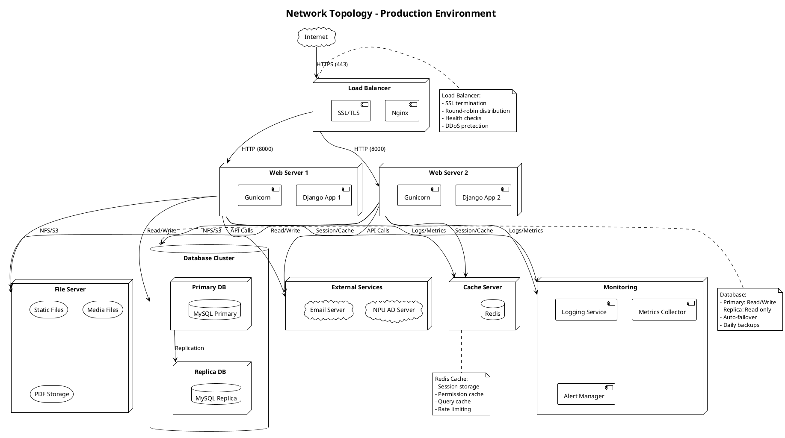

# 🏗️ UML Deployment & Component Diagrams - E-Money Voucher System

## 1. Deployment Diagram



---

## 2. Component Diagram - System Architecture



---

## 3. Component Diagram - Receipt System



---

## 4. Component Diagram - Permission System



---

## 5. Network Topology Diagram



---

## 6. Database Schema Component

```plantuml
@startuml
!theme plain
title Database Schema Components

package "Core Schema" {

  database "User Management" as user_db {
    table "accounts_user" as users
    table "accounts_role" as roles
    table "accounts_permission" as perms
    table "accounts_userrole" as userroles
  }

  database "Department Data" as dept_db {
    table "accounts_department" as depts
    table "accounts_documentvolume" as volumes
  }

  database "Receipt Data" as receipt_db {
    table "accounts_receipt" as receipts
    table "accounts_receiptitem" as items
    table "accounts_receipttemplate" as templates
  }

  database "Request Data" as request_db {
    table "accounts_receipteditrequest" as edit_reqs
    table "accounts_receipteditrequestitem" as edit_items
    table "accounts_receiptcancelrequest" as cancel_reqs
  }

  database "Audit Data" as audit_db {
    table "accounts_receiptchangelog" as changelog
    table "accounts_useractivitylog" as activity
  }
}

' Relationships
users --> userroles : has
roles --> userroles : assigned_to
roles --> perms : has_many
users --> depts : belongs_to
depts --> volumes : has
users --> receipts : creates
receipts --> items : has_many
receipts --> edit_reqs : has_many
receipts --> cancel_reqs : has_many
receipts --> changelog : has_many
edit_reqs --> edit_items : has_many
users --> activity : logged_by

note right of user_db
  Indexes:
  - ldap_uid (unique)
  - department (btree)
  - is_active (btree)

  Constraints:
  - userrole unique(user, role)
end note

note right of receipt_db
  Indexes:
  - receipt_number (unique)
  - status (btree)
  - created_at (btree)
  - department_id (foreign key)

  Full-text:
  - recipient_name
  - purpose
end note

note bottom of audit_db
  Retention:
  - changelog: Permanent
  - activity: 2 years

  Partitioning:
  - By timestamp (monthly)
end note

@enduml
```

---

## 7. Deployment Pipeline Diagram

```plantuml
@startuml
!theme plain
title CI/CD Deployment Pipeline

(*) --> "Code Commit"

"Code Commit" --> "Run Tests" : Git Push

partition "CI Pipeline" {
  "Run Tests" --> "Unit Tests"
  "Unit Tests" --> "Integration Tests"
  "Integration Tests" --> "Security Scan"
  "Security Scan" --> "Code Quality"
}

if "All Checks Pass?" then
  -->[true] "Build Docker Image"
  --> "Tag Image"
  --> "Push to Registry"
else
  -->[false] "Notify Developer"
  --> (*)
endif

partition "Deployment" {
  "Push to Registry" --> "Deploy to Staging"

  if "Staging Tests Pass?" then
    -->[true] "Manual Approval"

    if "Approved?" then
      -->[true] "Deploy to Production"
      --> "Run Migrations"
      --> "Restart Services"
      --> "Health Check"
    else
      -->[false] "Cancel Deployment"
      --> (*)
    endif
  else
    -->[false] "Rollback Staging"
    --> (*)
  endif
}

if "Health Check OK?" then
  -->[true] "Update Monitoring"
  --> "Notify Team"
  --> (*)
else
  -->[false] "Auto Rollback"
  --> "Restore Previous Version"
  --> "Alert Team"
  --> (*)
endif

note right of "Deploy to Production"
  Blue-Green Deployment:
  1. Deploy to inactive environment
  2. Run smoke tests
  3. Switch traffic
  4. Monitor metrics
  5. Keep old version ready
end note

@enduml
```

---

## Notes:
- Production uses load-balanced deployment
- Database replication for high availability
- Static files served via CDN or file server
- Redis for session and cache management
- All communications encrypted (HTTPS/TLS)

