# 🔄 UML Sequence Diagrams - E-Money Voucher System

## 1. Edit Request Flow - Basic User

---

## 2. Edit Request Flow - Department Manager

```plantuml
@startuml
!theme plain
title Edit Request Flow - Department Manager → Senior Manager

actor "Dept Manager" as dept
participant "Receipt" as receipt
participant "EditRequest" as request
participant "Senior Manager" as senior
database "Database" as db

dept -> receipt: create receipt (completed)
activate receipt
receipt -> db: save receipt
receipt --> dept: receipt created
deactivate receipt

== Edit Request Phase ==

dept -> request: submit edit request
activate request
request -> request: validate permissions\nhas_permission('receipt_edit_request')
request -> request: check if user is Dept Manager\nhas_permission('receipt_edit_approve')
request -> request: generate_request_number()
request -> db: save request (status=pending)
request --> dept: request created (pending)
deactivate request

== Senior Manager Approval ==

senior -> request: view pending requests
activate request
request -> request: filter by:\n- same department\n- requester is Dept Manager
request --> senior: show pending requests
deactivate request

senior -> request: approve/reject
activate request

request -> request: can_be_approved_by(senior)?
alt Check Permission
  request -> request: senior.has_permission(\n'receipt_edit_approve_manager')
  request -> request: senior.department ==\nreceipt.department.name
  request -> request: requester.has_permission(\n'receipt_edit_approve') ✅

  alt Approve
    request -> receipt: apply_changes()
    activate receipt
    receipt -> db: update receipt
    receipt -> db: log changes
    receipt --> request: applied
    deactivate receipt
    request -> db: status = applied
    request --> senior: ✅ approved
  else Reject
    request -> db: status = rejected
    request --> senior: ❌ rejected
  end
else Permission Denied
  request --> senior: ❌ cannot approve\n(not same department or\nnot senior manager permission)
end

deactivate request

@enduml
```

---

## 3. Cancel Request Flow - Basic User

---

## 4. Cancel Request Flow - Department Manager

---

## 5. Receipt Creation Flow

---

## 6. Permission Check Flow

```plantuml
@startuml
!theme plain
title Permission Check Flow

actor User
participant "View/Action" as view
participant "User Model" as user
participant "UserRole" as userrole
participant "Role" as role
participant "Permission" as perm

view -> user: has_permission('receipt_edit_approve')
activate user

alt Is Superuser or Staff
  user -> user: is_superuser == True\nor is_staff == True
  user --> view: ✅ True (bypass)
else Check Role Permissions
  user -> userrole: get_roles()
  activate userrole
  userrole -> userrole: filter(user=user, is_active=True)
  userrole --> user: user_roles
  deactivate userrole

  loop for each role
    user -> role: has_permission('receipt_edit_approve')
    activate role
    role -> perm: filter(name='receipt_edit_approve',\nis_active=True).exists()
    activate perm

    alt Permission Exists
      perm --> role: ✅ True
      role --> user: ✅ True
      user --> view: ✅ True (permission granted)
    else Permission Not Found
      perm --> role: ❌ False
      role --> user: ❌ False
      deactivate perm
      deactivate role
    end
  end

  user --> view: ❌ False (no permission)
end

deactivate user

@enduml
```

---

## 7. Department Scope Validation

```plantuml
@startuml
!theme plain
title Department Scope Validation Flow

actor "Manager" as mgr
participant "Request" as req
participant "Receipt" as receipt
participant "Permission Check" as check
database "Database" as db

mgr -> req: attempt to approve request
activate req

req -> check: can_be_approved_by(mgr)?
activate check

== Check 1: Department Match ==
check -> receipt: get receipt.department.name
activate receipt
receipt --> check: department_name
deactivate receipt

check -> mgr: get mgr.department
mgr --> check: user_department

alt Department Match
  check -> check: user_department ==\nreceipt.department.name ✅

  == Check 2: Permission Level ==
  check -> mgr: has_permission(\n'receipt_edit_approve_manager')

  alt Senior Manager Permission
    mgr --> check: ✅ True
    check -> req: get requested_by
    req --> check: requester
    check -> check: requester.has_permission(\n'receipt_edit_approve')

    alt Requester is Dept Manager
      check --> req: ✅ can approve
      req -> db: process approval
      req --> mgr: ✅ approved
    else Requester is Basic User
      check --> req: ❌ cannot approve\n(wrong permission level)
      req --> mgr: ❌ denied
    end

  else Dept Manager Permission
    mgr --> check: has_permission(\n'receipt_edit_approve')
    check -> check: requester is Basic User?\n!has_permission('receipt_edit_approve')

    alt Requester is Basic User
      check --> req: ✅ can approve
      req -> db: process approval
      req --> mgr: ✅ approved
    else Requester is Manager
      check --> req: ❌ cannot approve\n(same permission level)
      req --> mgr: ❌ denied
    end
  end

else Department Mismatch
  check --> req: ❌ cannot approve\n(different department)
  deactivate check
  req --> mgr: ❌ access denied
end

deactivate req

@enduml
```

---

## Notes:
- All flows enforce department scope rules
- Permission checks cascade from Superuser → Role → Permission
- Approval hierarchy is strictly enforced
- Audit logs are created for all state changes

