# 🔄 UML State Diagrams - E-Money Voucher System

## 1. Receipt State Diagram

```plantuml
@startuml
!theme plain
title Receipt Lifecycle State Diagram

[*] --> Draft: User creates receipt

state Draft {
  [*] --> Editing
  Editing --> Editing: User edits directly\n(no approval needed)
}

Draft --> Completed: User confirms receipt
Draft --> Cancelled: Owner cancels\n(direct, no approval)

state Completed {
  [*] --> Active
  Active --> HasEditRequest: Edit request submitted
  Active --> HasCancelRequest: Cancel request submitted

  state HasEditRequest {
    [*] --> PendingEdit
    PendingEdit --> PendingEdit: Awaiting approval
  }

  state HasCancelRequest {
    [*] --> PendingCancel
    PendingCancel --> PendingCancel: Awaiting approval
  }

  HasEditRequest --> Active: Edit approved\nand applied
  HasEditRequest --> Active: Edit rejected
  HasCancelRequest --> Active: Cancel rejected
}

Completed --> Modified: Edit approved\nchanges applied
Completed --> Cancelled: Cancel approved\nor direct cancel\n(Dept Mgr/Senior Mgr)

Modified --> Completed: After modifications\napplied

Cancelled --> [*]: Final state

note right of Draft
  Permissions Required:
  - receipt_create

  Can Edit Directly:
  - Owner only

  Can Cancel:
  - Owner (direct)
end note

note right of Completed
  Cannot Edit Directly
  Must submit edit request:
  - Basic User → Dept Mgr
  - Dept Mgr → Senior Mgr

  Cancel Options:
  - Basic User → request
  - Dept Mgr → direct/request
  - Senior Mgr → direct
end note

note right of Cancelled
  Final State
  Cannot be modified
  Cannot be restored

  Audit trail preserved
end note

@enduml
```

---

## 2. Edit Request State Diagram

```plantuml
@startuml
!theme plain
title Edit Request State Diagram

[*] --> Pending: User submits\nedit request

state Pending {
  [*] --> AwaitingApproval
  AwaitingApproval --> AwaitingApproval: In review queue

  state "Approval Decision" as Decision <<choice>>
  AwaitingApproval --> Decision: Approver reviews

  Decision --> Approved: ✅ Approved
  Decision --> Rejected: ❌ Rejected
}

Pending --> Withdrawn: User withdraws request

state Approved {
  [*] --> ReadyToApply
}

Approved --> Applied: System applies changes\nto receipt

Applied --> [*]: Final state

Rejected --> [*]: Final state
Withdrawn --> [*]: Final state

note right of Pending
  Approval Rules:

  Basic User Request:
  → Dept Manager approves
  (same department)

  Dept Manager Request:
  → Senior Manager approves
  (same department)

  Required Checks:
  - Department match
  - Permission level
  - Request status
end note

note left of Applied
  Changes Applied:
  1. Update receipt fields
  2. Update/add/delete items
  3. Create ReceiptChangeLog
  4. Update request status

  Permissions Required:
  - receipt_edit_approve (Dept Mgr)
  - receipt_edit_approve_manager (Senior)
end note

note right of Rejected
  Rejection Reasons:
  - Incorrect information
  - Invalid changes
  - Policy violation

  User can view:
  - rejection_reason
  - rejected_at
  - rejected_by
end note

@enduml
```

---

## 3. Cancel Request State Diagram

```plantuml
@startuml
!theme plain
title Cancel Request State Diagram

[*] --> Pending: User submits\ncancel request

state Pending {
  [*] --> AwaitingApproval

  state "Check Approver Permission" as PermCheck <<choice>>
  AwaitingApproval --> PermCheck: Approver reviews

  PermCheck --> Approved: ✅ Approved\n(has permission +\nsame department)
  PermCheck --> Rejected: ❌ Rejected\n(or no permission)
}

Pending --> Withdrawn: User withdraws\nrequest

state Approved {
  [*] --> ReadyToCancel
}

Approved --> Applied: Receipt cancelled\nstatus = 'cancelled'

Applied --> [*]: Final state
Rejected --> [*]: Final state
Withdrawn --> [*]: Final state

note right of Pending
  Cancel Request Rules:

  Draft Receipt:
  → No request needed
  → Owner cancels directly

  Completed Receipt:

  Basic User:
  → Submit request
  → Dept Manager approves

  Dept Manager:
  → Can cancel directly OR
  → Submit request to Senior

  Senior Manager:
  → Can cancel directly
  (no request needed)
end note

note left of Applied
  Cancellation Process:
  1. Update receipt.status = 'cancelled'
  2. Set cancelled_by = approver
  3. Set cancelled_at = now()
  4. Create ReceiptChangeLog
     action = 'cancelled'
  5. Update request.status = 'applied'

  Permissions:
  - receipt_cancel_approve (Dept)
  - receipt_cancel_approve_manager (Senior)
end note

note right of PermCheck
  Permission Validation:

  1. Department Match:
     user.department ==
     receipt.department.name

  2. Permission Level:
     - Dept Mgr approves Basic User
     - Senior Mgr approves Dept Mgr

  3. Self-Approval:
     Cannot approve own request
end note

@enduml
```

---

## 4. User Approval State Diagram

---

## 5. Permission Check State Diagram

---

## 6. Document Volume State Diagram

```plantuml
@startuml
!theme plain
title Document Volume Lifecycle

[*] --> Active: Volume created\n(auto or manual)

state Active {
  [*] --> InUse
  InUse --> InUse: Receipts created\nlast_document_number++

  state "Check Capacity" as Capacity <<choice>>
  InUse --> Capacity: After each receipt

  Capacity --> InUse: Still has capacity\n(< max_documents)
  Capacity --> Full: Reached max_documents
}

Active --> Closed: Fiscal year ends\nOR manual close

state Closed {
  [*] --> Sealed
  Sealed --> Sealed: No new receipts allowed
}

Closed --> Archived: Archive after retention period

Archived --> [*]: Final state

note right of Active
  Active Volume:
  - fiscal_year = current FY
  - status = 'active'
  - Receipts can be created
  - Document number auto-increment

  Example:
  - Volume: MIT68
  - Department: สำนักไอที
  - FY: 2568
  - last_document_number: 0042
  - max_documents: 9999
end note

note left of Closed
  Closed Volume:
  - status = 'closed'
  - closed_at = timestamp
  - closed_by = user
  - No new receipts allowed
  - Existing receipts preserved

  Triggers:
  1. Auto: Fiscal year transition
  2. Manual: Admin closes volume
end note

note right of Archived
  Archived Volume:
  - status = 'archived'
  - Read-only access
  - Retained for audit
  - May be deleted per policy

  Retention Period:
  - Configurable (default: 10 years)
  - Legal/audit requirements
end note

@enduml
```

---

## 7. Complete System State Flow

---

## Notes:
- All state transitions are logged in ReceiptChangeLog
- Permission checks occur before each state transition
- Department scope rules apply to all approval states
- Final states (Cancelled, Rejected, Applied) are immutable
- Audit trail preserved for all state changes

