# 👥 UML Use Case Diagrams - E-Money Voucher System

## 1. Overall System Use Case Diagram

---

## 2. Basic User Use Cases

---

## 3. Department Manager Use Cases

---

## 4. Senior Manager Use Cases

```plantuml
@startuml
!theme plain
title Senior Manager Use Cases

actor "Senior Manager" as senior
actor "Department Manager" as dept

rectangle "High-Level Approvals" {
  usecase "Review Dept Manager\nEdit Requests" as reviewMgrEdit
  usecase "Approve Manager\nEdit Request" as approveMgrEdit
  usecase "Reject Manager\nEdit Request" as rejectMgrEdit
  usecase "Review Dept Manager\nCancel Requests" as reviewMgrCancel
  usecase "Approve Manager\nCancel Request" as approveMgrCancel
  usecase "Reject Manager\nCancel Request" as rejectMgrCancel
}

rectangle "Department Control" {
  usecase "Direct Cancel\nAny Receipt" as directCancel
  usecase "View All Department\nReceipts" as viewAll
  usecase "Override Decisions" as override
  usecase "Manage Department\nSettings" as manageDept
}

rectangle "Reporting & Analytics" {
  usecase "View Department\nPerformance" as performance
  usecase "Generate Advanced\nReports" as advReports
  usecase "Analyze Trends" as trends
  usecase "Review Audit Trail" as audit
}

senior --> reviewMgrEdit
reviewMgrEdit ..> approveMgrEdit: <<extend>>
reviewMgrEdit ..> rejectMgrEdit: <<extend>>

senior --> reviewMgrCancel
reviewMgrCancel ..> approveMgrCancel: <<extend>>
reviewMgrCancel ..> rejectMgrCancel: <<extend>>

senior --> directCancel
senior --> viewAll
senior --> override
senior --> manageDept

senior --> performance
senior --> advReports
senior --> trends
senior --> audit

dept --> reviewMgrEdit: "Submits requests"
dept --> reviewMgrCancel: "Submits requests"

note right of approveMgrEdit
  Permission Required:
  - receipt_edit_approve_manager

  Validation:
  1. Same department
  2. Requester is Dept Manager
  3. Requester has receipt_edit_approve
  4. Valid request status

  Hierarchy:
  Senior Mgr → Dept Mgr → Basic User
end note

note right of directCancel
  Permission Required:
  - receipt_cancel_department
  - receipt_cancel_approve_manager

  Can cancel:
  - Any receipt in department
  - Without approval
  - Regardless of status
  - Creates audit log
end note

note bottom of override
  Special Permissions:
  - Can modify approved requests
  - Can reverse decisions
  - Full department authority
  - Subject to audit
end note

@enduml
```

---

## 5. System Admin Use Cases

---

## 6. Public User Use Cases

```plantuml
@startuml
!theme plain
title Public Receipt Verification Use Cases

actor "Public User" as public

rectangle "QR Code Verification" {
  usecase "Scan QR Code" as scan
  usecase "Enter Receipt Number" as enter
  usecase "Verify Receipt" as verify
  usecase "View Receipt Details" as viewDetails
  usecase "Check Authenticity" as checkAuth
  usecase "Download Verification PDF" as downloadPDF
}

rectangle "Public Information" {
  usecase "View Organization Info" as orgInfo
  usecase "View Department Info" as deptInfo
  usecase "View Receipt Status" as status
}

public --> scan
public --> enter
scan ..> verify: <<include>>
enter ..> verify: <<include>>

verify --> viewDetails
viewDetails ..> checkAuth: <<include>>
viewDetails ..> downloadPDF: <<extend>>

public --> orgInfo
public --> deptInfo
public --> status

note right of verify
  No Authentication Required

  Access Method:
  1. Scan QR Code
  2. Enter receipt number manually

  URL Pattern:
  /check/{date_part}/{number_part}

  Example:
  /check/021068/0042
end note

note right of viewDetails
  Public Information Shown:
  - Receipt number
  - Issue date
  - Department name
  - Total amount
  - Purpose
  - Status (Active/Cancelled)

  Hidden Information:
  - Recipient personal details
  - Edit/Cancel history
  - Internal notes
end note

note bottom of checkAuth
  Authenticity Checks:
  ✓ Valid receipt number
  ✓ Exists in database
  ✓ Not cancelled
  ✓ Valid QR code
  ✓ Matches organization

  Visual Indicators:
  🟢 Valid & Active
  🔴 Cancelled
  ⚠️ Not Found
end note

@enduml
```

---

## 7. Workflow Use Case Diagram

---

## Notes:
- All use cases enforce role-based permissions
- Department scope applies to all approval use cases
- Audit logging is automatic for all state changes
- Public access is read-only and limited

